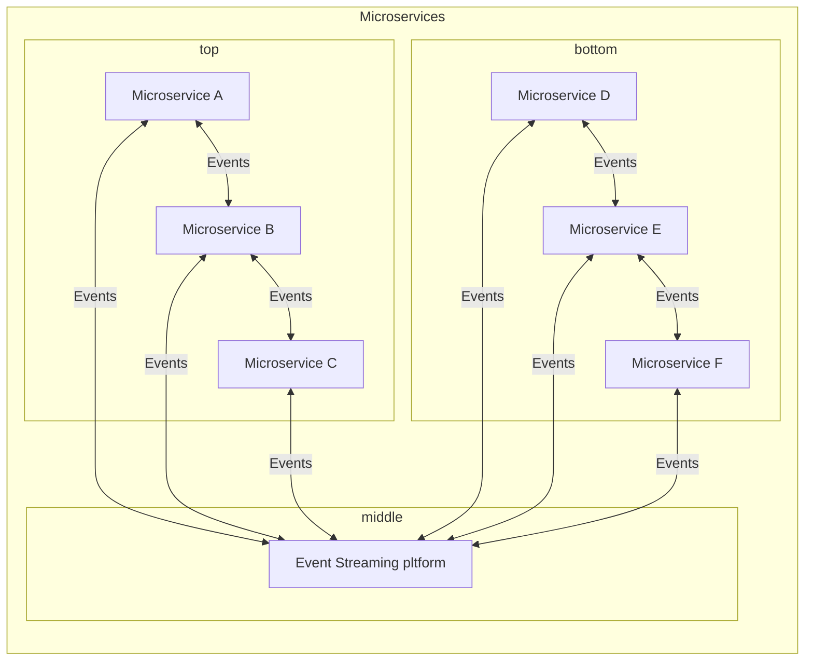

> [Home](Home.md)

# Apache Kafka for Beginners

## Status : IN_PROGRESS

## Links

- [O'Reilly Course link](https://learning.oreilly.com/videos/apache-kafka-for/9781803247090/)

## Chapter 1 - Getting started with course

## Chapter 2 - Getting started with Kafka

A quick overview of current software development landscape and how Kafka fits into it.

Applications are built as monoliths whereas currently they are being broken down into microservices.

The microservices communicate though an even streaming platform like Kafka via events.

Event streaming platform provides a platform to publish and subscribe to events. These events are analysed, processed and stored.

Apache Kafka is an event streaming platform.

Major differences with traditional messaging systems:

| Traditional messaging system    | Apache Kafka                                             |
| ------------------------------- | -------------------------------------------------------- |
| Messages are consumed when read | Messages are retained for the duration of retention time |
| Brokers track consumed messages | Consumers track consumed messages                        |
| Fixed consumers                 | Any number of consumers can be added                     |
| May not be distributed          | Distributed                                              |

> [Home](HOME.md)
