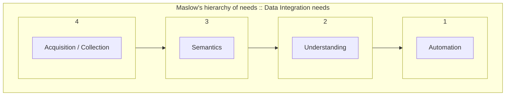
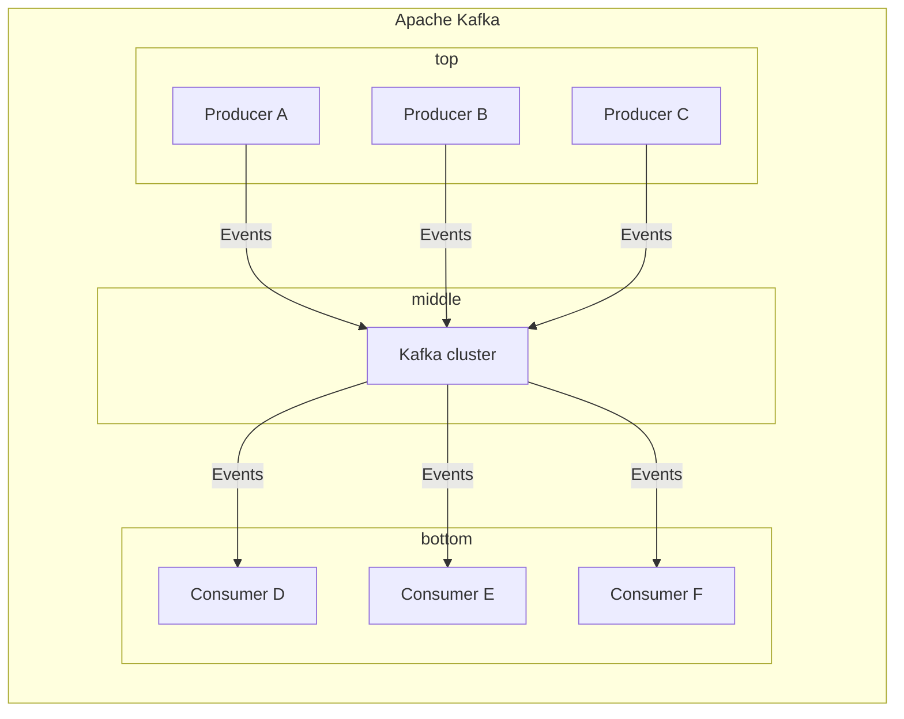
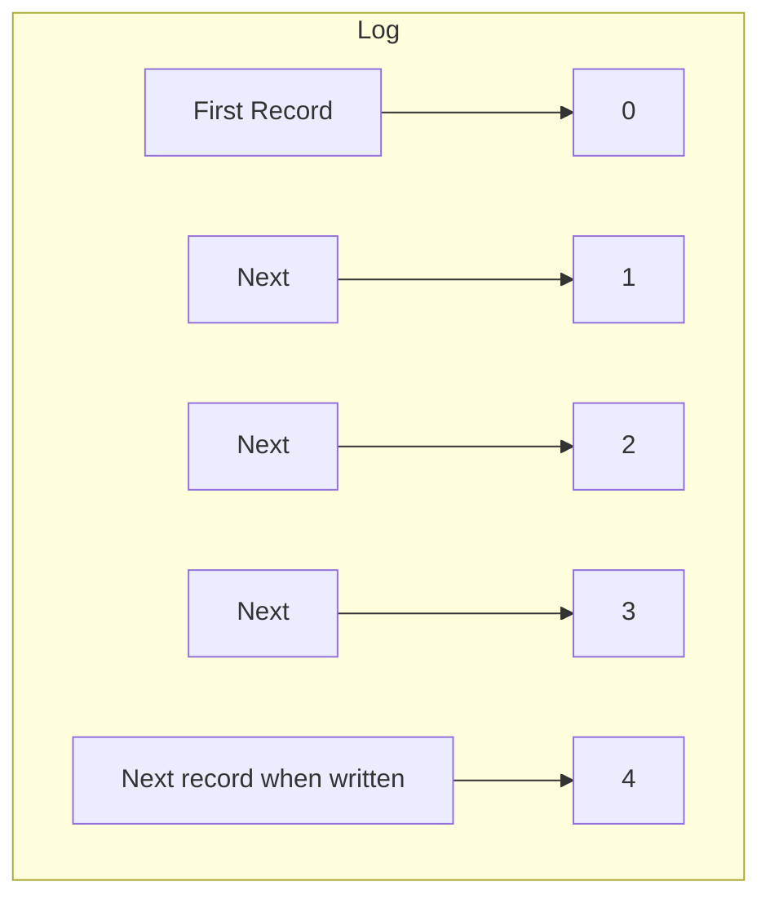
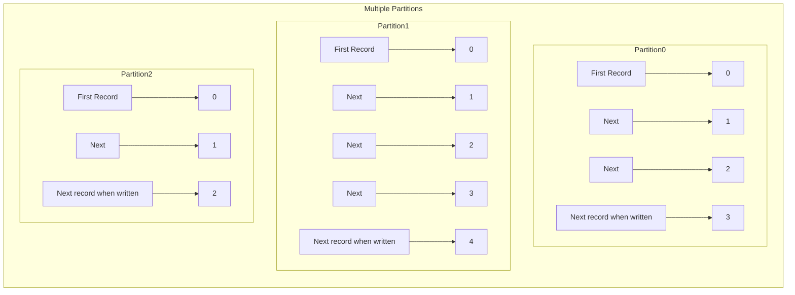
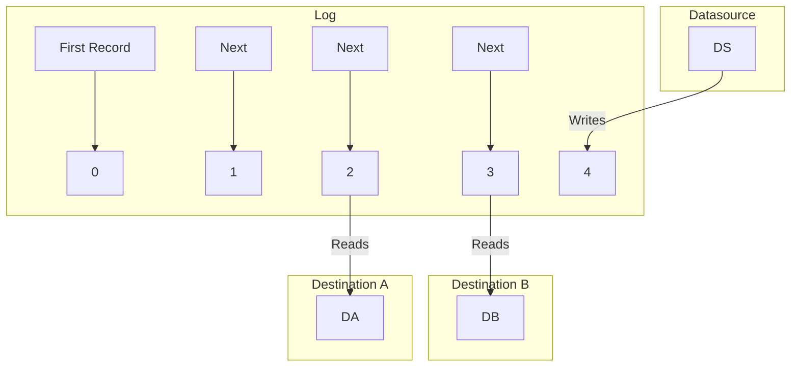
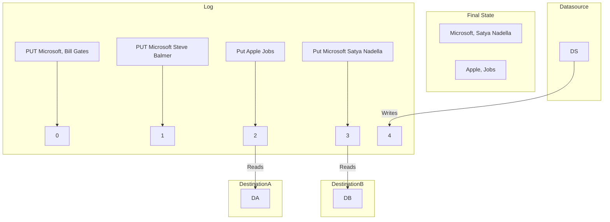
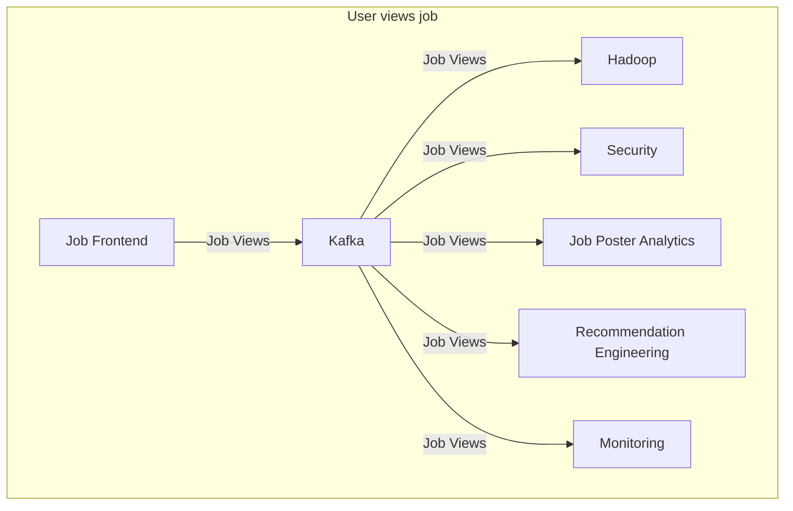
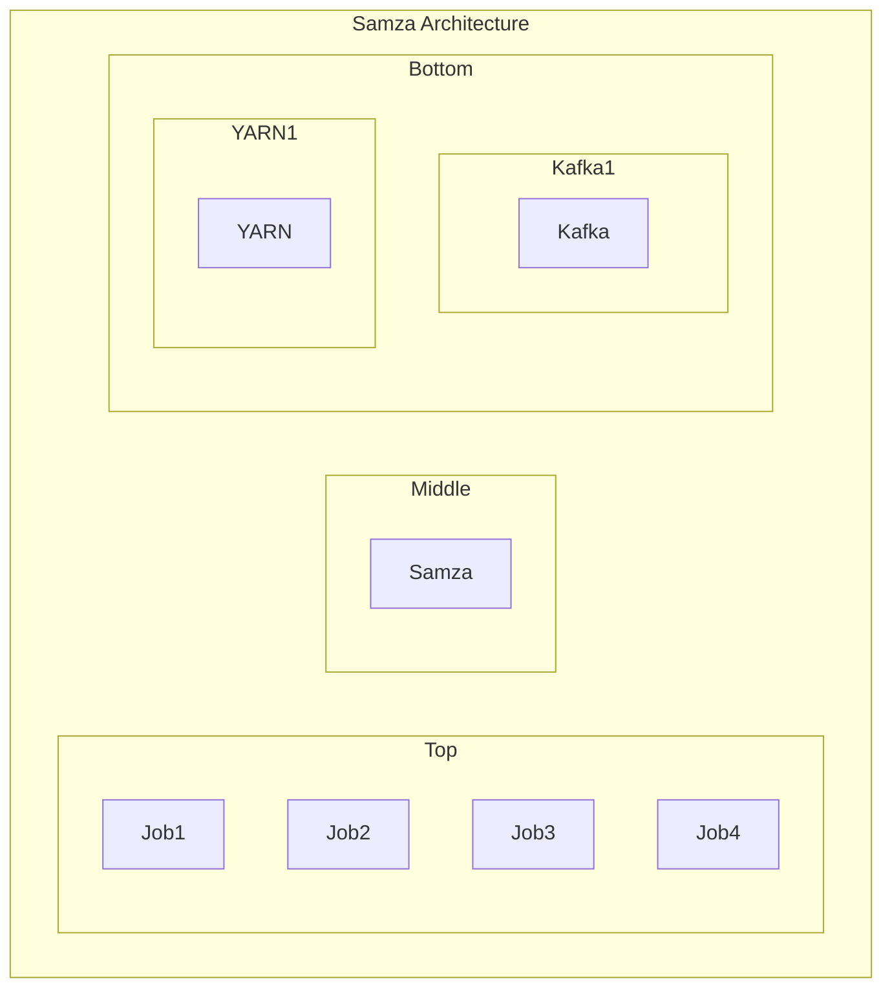
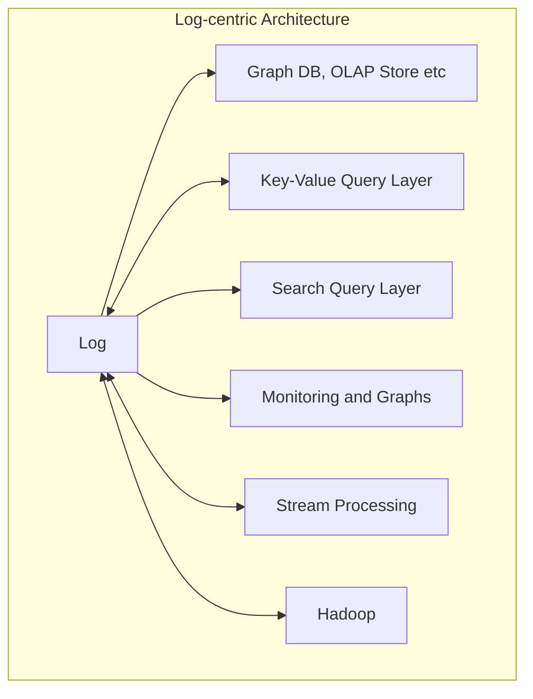

> [Home](Home.md)

# I ❤ Logs: Apache Kafka and Real-time Data Integration

## Status : DONE

## Course info

- [Link to O'Reilly video course](https://learning.oreilly.com/videos/i-logs/9781491908310/)
- Author : Jay Kreps
- Publication Date : June 2014

## What is Data Integration ?

While working at LinkedIn, realised the importance of getting data into the systems both real-time and batch (Hadoop) to be able to do analytics.

An analogy with Maslows's hierarchy of needs where data acquisition is at the bottom of the pyramid.

Data infrastructures like Hadoop cluster is only as good as the data it gets. FTPing files was the most common way to move data around.

Why is this a hard problem?

Two reasons :

1. Type of data has changed in the last 10 - 15 years. Rather than transactional data, you now have event data - user activity data.
2. Specialist databases are used rather than general purpose relational databases. For example key value or monitoring, search etc.

How easy is it to get this data?

While working on Hadoop at LinkedIn, noticed that there was not a lot of data in the cluster and more time was spent on getting data into the cluster than doing analytics.

Data becomes a basis of everything. It can lead to insights, so it's important, and hence it's captured in different systems.

However, this is captured in a custom way from several different sources and these capturing is repeated and in is built in an adhoc manner. This leads to N2 squared problem.

There is a need to verify data before capture as it remains in the system forever and apply a centralised approach to data capture based around a date time log.

Large data integration problem can be solved by using the concept of the logs.

## What is Apache Kafka ?

Kafka is a messaging system.

Events flow into and out of Kafka in real-time and each elements the above diagram is distributed.

This looks like a traditional pub/sub messaging, however, the implementation is architectural different from traditional messaging systems.

Amazon Kinesis is very similar to Kafka, it came later and is possibly inspired by it. So it gives a validation to the fundamental idea behind Kafka.

Jay Kreps is thrilled as his first project was a DynamoDB derivation, and now  Amazon has cloned Kafka! Both are very similar. Amazon Kinesis is hosted by Amazon whereas Kafka you have to host yourself.

Can this be solved in Infrastructure?

Each pipeline solved a different problem.

- database copies were different to ETL data.
- Active MQ ingestion was different.

A common system was required to solve all these problems.

Tried using Active MQ, it didn't work as it was not build for high-throughput, logging or event data like page view events. Data not persistent for longer periods for example if Hadoop cluster is down. It would need something like 300 active brokers!! 300 logging brokers for 300 machines is not tenable!

ETL was done with files, messaging with messages.
There was a huge difference between the two.

This lead to the following 3 design principles:

### 3 design principles:

**1. One pipeline to rule them all.**

**2. Stream processing >> messaging.**

Message Brokers hold on to data and do not do any processing on it.

Hadoop is doing something higher level, in addition to HDFS, it allows map reduce and other processing.

Should allow stream processing in a rich way.

**3. Clusters not servers**

True of HDFS. Processing of files across machines. Not true of individual message brokers!! Queues and topics are on a particular machine.

### Characteristics

**Scalability of the file system**

- Hundreds of MB/sec/server throughput. (Logging/ log copying)
- Many TB per server.

**Guarantees of a database**

- Messages are strictly ordered
- All data is persistent
  
**Distributed by default**
- Replication -> individual machines can fail without losing data
- Partitioning model -> scale by adding more machines

Built and used heavily at LinkedIn.

### Kafka at LinkedIn

- 175 TB of in-flight data.
- Low-latency: ~ 1.5 ms
- Replicated to each data center
- Tens of thousands of data producers
- Thousands of data consumers
- 7 million messages written per second
- 35 million messages read per second ( loading of data happens automatically - versus a team doing it)

See

- [Latency numbers every programmar should now](https://gist.github.com/hellerbarde/2843375)
- [Low latency ](http://shorttermmemoryloss.com/nor/2015/01/04/low-latency/)
- [Latency Numbers Every Programmer Should Know](https://colin-scott.github.io/personal_website/research/interactive_latency.html)

## Logs and Distributed Systems

It's a different way of thinking about data, while database provides tables, Kafka provides logs. Think of it differently than server logs though.

- It's append only as a regular log.
- Structured array of feed of messages
  - It's ordered by time, newer writes happen at the end.
  - It's immutable -> records don't change after they are written.
  - each record can be denoted by a unique number (A log sequence number or an offset in Kafka terms)
  - Ignore the format of messages, can think of it like a log line.

If you partition it, you get the Kafka data model.

Topic is a category of data, for example page views, searches. Each of these is partitioned by say user id. Each partition is a sequence of records that are being continuously  appended to. Maintained for a week or so.

How is this a a messaging system, it's like an Apache log?
Logs are fantastic mechanism for implementing a publish subscribe system.

All subscribers see the same sequence of data.
In messaging not all consumers see the same data! (Possibly had point-to-point messaging in mind)

Log sequence number acts as a proxy of time. A record that comes after another record in the log is newer.

Idea of logs keep coming in many different contexts. DBs replicate using logs. Google's spanner uses logs.

Recently Leslie lamport won a turing award for his work on a consensus algorithm called PAXOS which is a consensus algorithm. It maintains agreement on a distributed log. Allows you to build fault-tolerant distributed log.

Quite a fundamental idea.

Used for two things:

1. For replicating data
2. For consistency - multiple systems agree on the same sequence of events.

Example a fault tolerant distributed CEO Hash Table.

Single system -> not a problem.

Multiple systems will lead to many problems.

How databases maintain the sequence of updates.

There are two design styles

1. State machine replication
2. Primary backup replication (master slave)

## Logs and Data Integration

Example : User views job

Gets complicated over time.

Job front end can publish and the consumers can subscribe.

It's all one big distributed system and they all have exactly the same replication and consistency problems like a database, but they have in the large.

A commit log keeps everybody in sync on the same set of data as that data changes in real time. 

Traditionally you have two solutions

1. Copy files around or
   1. Data delivered in milli seconds.
   2. Multi subscriber

2. Messaging
   1. Single log vs queue per subscriber
   2. Large persistent data

## Logs and Stream Processing

A processing layer will run in real time.

Think of all your data as a big distributed database. Kafka is like a commit log for that database.

Stream processing is a trigger or a materialized view of that system.

A way to compute new things of those things. 

Different from map reduce as it's real time processing.

Next evolution of message processing.

Stream processing gives richer semantics which a messaging system doesn't.

Stream processing is no longer niche. 

### Difference between a batch process and a stream process.

Think of US Census. Actually every 10 years, somebody goes to each house and counts the number of people. That is batch processing.

Easier way would be to have a log of all the births and deaths. This way you'll know the population at any point in time. You can go back in time as well. This is stream processing.

[Analogous example. How many people are there in the party? Send someone to check every hour. This is batch processing. Another way is to have a log of people entering and leaving the party. This is stream processing. This log will tell us at any point in time how many people are there in the party].

Stream processing is taking logs and transforming them into new logs.

Similar to trigger or materialized view in a database.

Systems that subscribe do not care whether it's the original stream or a derived stream. 

Stream processing is the ability to do real time data processing of of your real time feeds.

Stream processing is a generalization of batch processing.

Batch - you process all your records.
Request-Response - you process one record at a time.

Stream processing is a generalisation in  between the two. You take some number of records and output some number of records.

There is no end of the stream. It's a continuous stream. But's that true for all data. Batch jobs only take a arbitrary subset of the time. It's better to have a control over the time, especially for domains that are low latency.

At LinkedIn
- 50 % - Request-Response
- 25 % - Batch
- 25 % - Stream - low latency, asynchronous processing  (not well supported now)

Examples of stream processing

 - Monitoring
 - Security
 - Content processing
 - Recommendations
 - Newsfeed
 - ETL

Samza and Storm make use of Kafka.

Samza architecture

> [Home](HOME.md)
